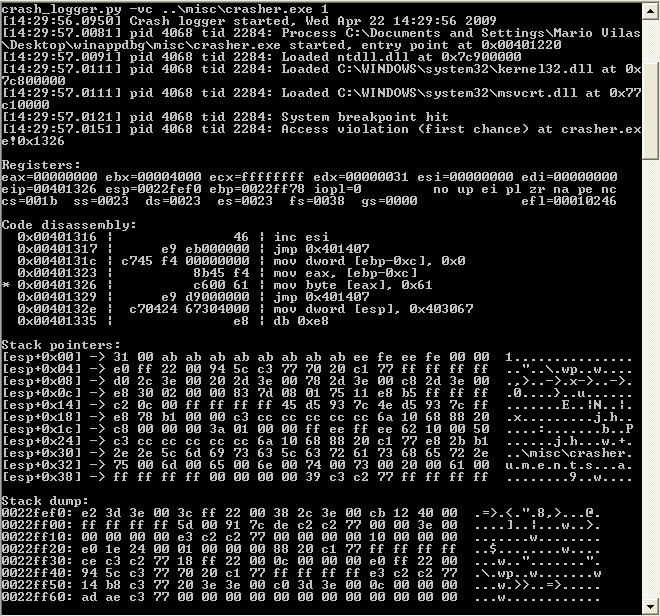

.. _tools:

Tools
*****

The *WinAppDbg* package comes with a collection of tools useful for common tasks when debugging or fuzzing a program. The most important tool, the :ref:`Crash logger <crash-logger>`, attaches to any number of target processes and collects crash dump information in a SQLite database. It can also apply :ref:`heuristics <crash-key>` to discard multiple occurrences of the same crash.

The source code of these tools can also be read for more examples on programming using *WinAppDbg*.

The following tools are shipped with the *WinAppDbg* package:

.. _crash-logger:

Crash logger
++++++++++++

* :download:`crash_logger.py <../../tools/crash_logger.py>` :

   Attaches as a debugger or starts a new process for debugging. Whenever an interesting debug event occurs (i.e. a bug is found) it can save the info to a database and/or log it through standard output.

   Some simple :ref:`heuristics <crash-key>` can be used to try to determine whether two crashes were caused by the same bug, in order to discard duplicates. It can also try to guess how exploitable would the found crashes be, using similar heuristics to those of `!exploitable <http://msecdbg.codeplex.com/>`_.

   Additional features allow setting breakpoints at the target process(es), attaching to spawned child processes, restarting crashed processes, and running a custom command when a crash is found.

* :download:`crash_report.py <../../tools/crash_report.py>` :

   Shows the contents of the crashes database file to standard output.

* :download:`crash_report_mssql.py <../../tools/crash_report_mssql.py>` :

   Shows the contents of the crashes MS SQL database to standard output.

Process tools
+++++++++++++

These tools were inspired by the **ptools** suite by `Nicolás Economou <http://tinyurl.com/nicolaseconomou>`_.

* :download:`pinject.py <../../tools/pinject.py>` :

   Forces a process to load a DLL library of your choice.

* :download:`plist.py <../../tools/plist.py>` :

   Shows a list of all currently running processes.

* :download:`pmap.py <../../tools/pmap.py>` :

   Shows a map of a process memory space.

* :download:`pfind.py <../../tools/pfind.py>` :

   Finds the given text, binary data, binary pattern or regular expression in a process memory space.

* :download:`pread.py <../../tools/pread.py>` :

   Reads the memory contents of a process to standard output or any file of your choice.

* :download:`pwrite.py <../../tools/pwrite.py>`:

   Writes to the memory of a process from the command line or any file of your choice.

* :download:`pkill.py <../../tools/pkill.py>` :

   Terminates a process or a batch of processes.

* :download:`ptrace.py <../../tools/ptrace.py>` :

   Traces execution of a process. It supports three methods: single stepping, single stepping on branches, and native syscall hooking.

* :download:`pdebug.py <../../tools/pdebug.py>` :

   Extremely simple command line debugger. It's main feature is being written entirely in Python, so it's easy to modify or write plugins for it.

Miscellaneous
+++++++++++++

* :download:`SelectMyParent.py <../../tools/SelectMyParent.py>` :

   Allows you to create a new process specifying any other process as it's parent, and inherit it's handles. See the `blog post by Didier Stevens <http://blog.didierstevens.com/2009/11/22/quickpost-selectmyparent-or-playing-with-the-windows-process-tree/>`_ for the original C version.

* :download:`hexdump.py <../../tools/hexdump.py>` :

   Shows an hexadecimal dump of the contents of a file.

